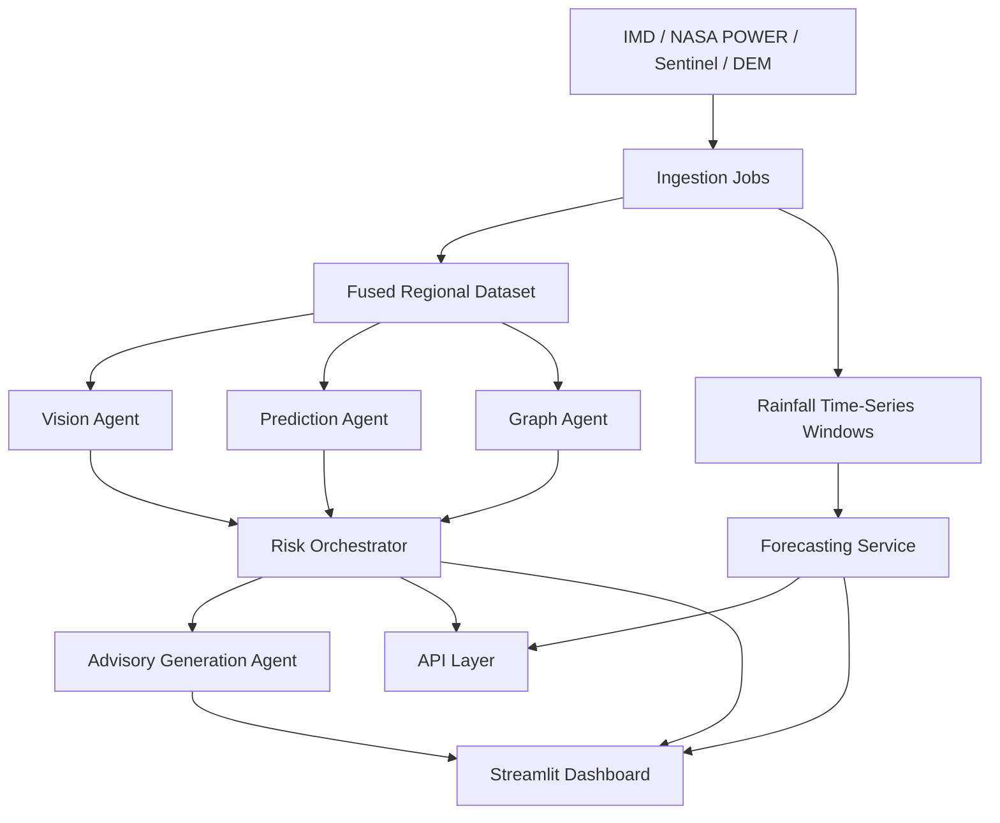

# System Architecture

## Title

Multi-Agent AI System for Real-Time Landslide Detection, Prediction and Advisory Generation using Satellite, Weather and Terrain Data

## High-Level Flow

## Core Modules

- `Vision Agent`: derives terrain-change and vegetation stress signals from NDVI and remote-sensing style features.
- `Prediction Agent`: calculates current and forecast landslide risk from rainfall, slope, soil wetness, vegetation, and graph signals.
- `Graph Agent`: builds an adjacency-weighted spatial graph and propagates risk across nearby regions.
- `Advisory Agent`: converts risk outputs into human-readable warnings and explanations.
- `Forecasting Service`: uses saved model artifacts for rainfall forecasting without retraining at runtime.
- `System Service`: provides reusable backend methods for dashboard, API, and future deployment clients.

## Runtime Layers

- `Ingestion Layer`: pulls raw source data and writes manifests for traceability.
- `Feature Fusion Layer`: merges weather and terrain into a region-wise dataset.
- `Inference Layer`: computes risk assessments, alerts, and forecasts.
- `Presentation Layer`: serves results through Streamlit and FastAPI.

## Why This Is Research-Oriented

- Multi-agent decomposition makes the system modular and explainable.
- Spatial propagation introduces graph-based regional coupling instead of isolated classification.
- Forecast windows support sequence modeling for future LSTM or transformer-based rainfall prediction.
- Advisory generation converts scientific signals into public-facing district advisories.

## Current Advanced Features

- Spatial graph propagation with adjacency normalization
- Scenario simulation for rainfall, soil wetness, NDVI, and network spillover
- Saved forecast model artifacts
- API-key-ready backend
- Docker packaging and automated tests

## Next Research Upgrades

- Replace graph propagation heuristic with a trainable GNN
- Replace placeholder NDVI and image signals with actual Sentinel-derived raster features
- Replace baseline rainfall forecaster with a trained LSTM on a richer time horizon
- Add uncertainty calibration and alert-threshold tuning
